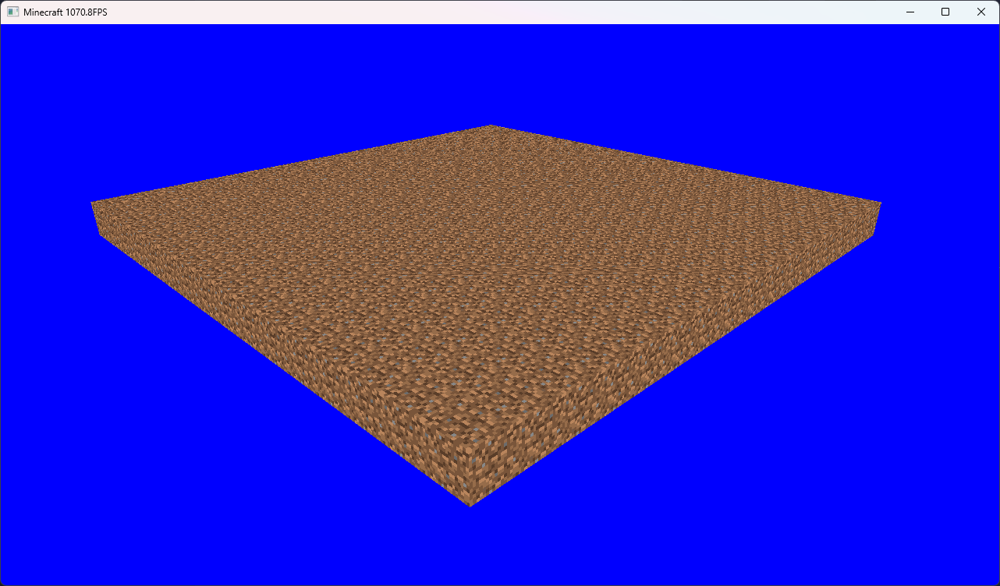
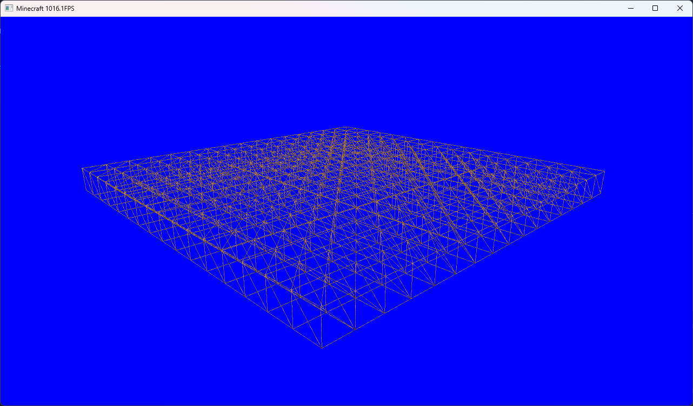

## Minecraft clone

A Minecraft clone made with OpenGL and C++. For now it is under development.

  

### Controls:
- **W, Z**: Move forward
- **A, Q**: Move on the left
- **S**: Move backward
- **D**: Move on right
- **L_Shift**: Go down
- **Space**: Go up

- **F11**: Toggle fullscreen
- **F3**: Toggle wireframe view
- **ESC**: Quit

Feel free to fork the project or contact me if you have ideas or advices !
